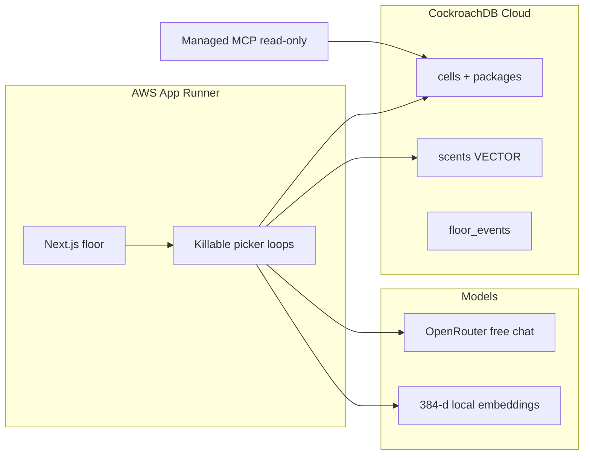

# Stigmergy

Warehouse bots that never message each other. They only write **scents** into [CockroachDB](https://www.cockroachlabs.com/). The heatmap of the table *is* the swarm.

This is an agentic memory demo for the **CockroachDB × AWS — Build with Agentic Memory** hackathon. Memory is not a chat log. It is locks, embeddings, and audit rows in one serializable database.

**Demo URL:** _add App Runner URL after deploy_  
**Video:** _add public YouTube / Vimeo link_

## Why this exists

Most multi-agent demos are a group chat with extra steps: a supervisor, a message bus, a vector store that drifts from the job board. In a warehouse, two pickers grabbing the last insulin is a **write conflict**, not a misunderstanding.

Ants coordinate with pheromones. Stigmergy pickers:

1. Read free/reserved cells with SQL
2. Smell similar dead-ends with **distributed vector search**
3. Claim a cell with `UPDATE … WHERE reserved_by IS NULL` at `SERIALIZABLE`
4. On conflict, insert a `dead_end` scent — never a chat message

Kill the processes. RAM is gone. Reservations stay. Respawn the same picker ids; they continue from Cockroach, not from memory.

## Architecture



There is no orchestrator assigning tasks. **Spawn** only starts empty workers. Each worker queries the floor and decides its own next cell.

## CockroachDB tools (what the agent actually did)

| Tool | How pickers / inspectors use it |
| --- | --- |
| **Distributed Vector Indexing** | Failure scents are `VECTOR(384)` with a **prefix-column index on `warehouse_id`**. Before each move, a picker queries similar `dead_end` / `jam` rows (`embedding <-> query`) so the swarm flows around past traps. Floor B cannot leak trails into Dock B. |
| **Managed MCP Server** | Human / judge inspector. Read-only view of who holds which cell. MCP default cannot steal a reservation. See [`skills/stigmergy-floor/SKILL.md`](skills/stigmergy-floor/SKILL.md) and in-app [`/inspector`](/inspector). |

CockroachDB is the **only** memory: occupancy, package claims, embeddings, and the event rail live in one database. We do **not** use Amazon Bedrock AgentCore Memory.

## AWS services

| Service | How it is used |
| --- | --- |
| **AWS App Runner** | Hosts the Next.js process that *is* the agent runtime: killable in-process picker loops + the live floor. This is the functional demo URL. Stateless compute; durable memory is Cockroach. |

Chat completions are **OpenRouter** (free model) so the swarm still runs without Bedrock. If OpenRouter is missing or rate-limited, pickers fall back to a deterministic heuristic. Embeddings are local 384-d n-gram vectors (MiniLM width) so C-SPANN always has a consistent space.

## Run

Operator steps (cluster, MCP, App Runner, tests) are in **[SETUP.md](SETUP.md)**.

```bash
cp .env.example .env.local
npm install
npm test
STIGMERGY_STORE=memory npm run dev
```

Open [http://localhost:3000](http://localhost:3000). For the real memory layer set `DATABASE_URL` to Cockroach Cloud and run `npm run db:schema`.

## Demo (90 seconds)

1. Floor loads. **INSULIN · last unit** is labeled.
2. **Spawn 8**. The right rail is committed SQL, not chat.
3. Two pickers hit the last insulin. One `UPDATE` wins. The loser inserts a red dead-end scent.
4. Later pickers avoid that aisle (vector recall + the lock).
5. **Kill half**. Beetles extinguish. Cyan locks stay. **Respawn same ids** — they resume from the table.
6. Cursor MCP (or `/inspector`): “Who holds the insulin?” Writes denied.

Caption: `SERIALIZABLE · memory = CockroachDB`

## Tests

```bash
npm test                  # unit + in-memory serializable store
npm run test:integration  # requires DATABASE_URL (Cockroach)
npm run test:e2e          # Playwright HUD smoke
```

## License

[MIT](LICENSE)
