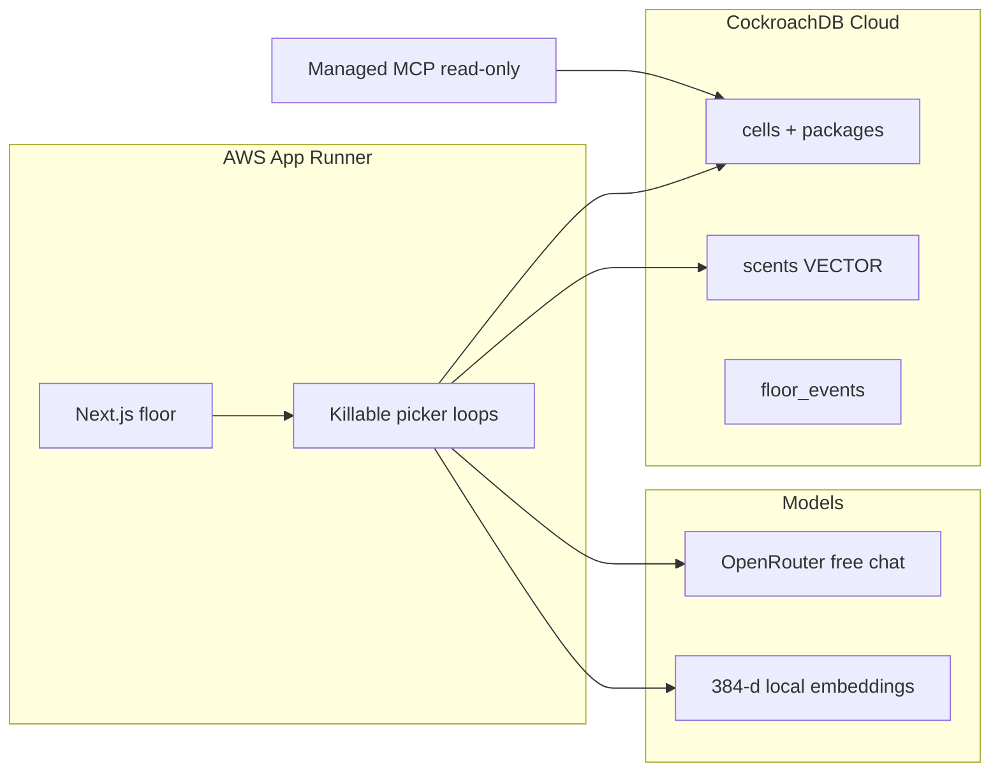

# Stigmergy

Warehouse bots that never message each other. They only write **scents** into [CockroachDB](https://www.cockroachlabs.com/). The heatmap of the table *is* the swarm.

This is an agentic memory demo for the **CockroachDB × AWS — Build with Agentic Memory** hackathon. Memory is not a chat log. It is locks, embeddings, and audit rows in one serializable database.

**Demo URL:** _add App Runner URL after deploy_  
**Video:** _add public YouTube / Vimeo link_

## Why this exists

This floor seeds one last **SPARE**. Eight pickers can walk toward it with no boss. Two of them claiming the same box is a **write conflict**. These pickers do not message each other.

Ants coordinate with pheromones. Stigmergy pickers:

1. Read free/reserved cells with SQL
2. Look up similar past failures with **distributed vector search**
3. Claim a cell with `UPDATE … WHERE reserved_by IS NULL` at `SERIALIZABLE`
4. On conflict, insert a `dead_end` scent — never a chat message

A picker can reach a shelf it is standing next to, not only one it is standing on. Cell locks stop two pickers sharing a square, but they cannot stop both reaching for the same unit — so the package claim is what settles it. One `UPDATE` returns 1 row, the other returns 0, and the loser writes down where it failed.

Stop the picker loops and the reservations stay in `cells`. Restart the same picker ids and they read their position back out of the table, because nothing about where they were was ever held in the worker.

## Architecture



There is no orchestrator assigning tasks. **Spawn** only starts empty workers. Each worker queries the floor and decides its own next cell.

## CockroachDB tools (what the agent actually did)

| Tool | How pickers / inspectors use it |
| --- | --- |
| **Distributed Vector Indexing** | Failure scents are `VECTOR(384)` with a **prefix-column index on `warehouse_id`**. Before each move, a picker queries similar `dead_end` / `jam` rows (`embedding <-> query`) so the swarm flows around past traps. Floor B cannot leak trails into Dock B. **Turn memory off** in the UI to run the same swarm with that query skipped, and compare. |
| **Managed MCP Server** | Human / judge inspector. Read-only view of who holds which cell. MCP default cannot steal a reservation. See [`skills/stigmergy-floor/SKILL.md`](skills/stigmergy-floor/SKILL.md) and in-app [`/inspector`](/inspector). |

CockroachDB is the **only** memory: occupancy, package claims, embeddings, and the event rail live in one database. We do **not** use Amazon Bedrock AgentCore Memory.

## AWS services

| Service | How it is used |
| --- | --- |
| **AWS App Runner** | Hosts the Next.js process that *is* the agent runtime: killable in-process picker loops + the live floor. This is the functional demo URL. Stateless compute; durable memory is Cockroach. |

### What the model does and does not do

Being precise about this, because it is easy to overclaim:

- **OpenRouter** (free model) writes the human-readable `reason` text on a scent, and nothing else. Routing is not a model call. If the key is missing or rate-limited, a deterministic template is used instead and behaviour is unchanged.
- **Movement is fully deterministic** given the database state: `chooseNextCell` in `lib/policy.ts` runs a shortest-path search to the destination where entering a cell costs one step plus the strength of any similar remembered failure near it (`cellCost`). A picker therefore takes a visibly longer route around a cell where a claim was lost, and still arrives. There is no LLM in the movement path.
- **Recall biases routing; it cannot deadlock it.** Costing a whole path rather than greedily picking the best-looking neighbour is deliberate: greedy stepping against a scent field strong enough to actually divert anyone produces local minima, where carriers oscillate between two cells and the floor never clears. `tests/contention.test.ts` pins both properties — contention happens, and every package still reaches the dock.
- **Embeddings are deterministic 384-dimension character n-gram hashes** (`lib/embed.ts`), not a learned model. 384 is chosen to match MiniLM's width so the vector column and index are realistic; the vectors themselves are not MiniLM-quality semantics. Similar wording clusters, and that is all the recall relies on.

The upside of that last point: the retrieval quality you see is attributable to CockroachDB's vector index rather than to a model.

## Run

Operator steps (cluster, MCP, App Runner, tests) are in **[SETUP.md](SETUP.md)**.

```bash
cp .env.example .env.local
npm install
npm test
STIGMERGY_STORE=memory npm run dev
```

Open [http://localhost:3000](http://localhost:3000). For the real memory layer set `DATABASE_URL` to Cockroach Cloud and run `npm run db:schema`.

## Demo (90 seconds)

The floor is a set of experiments rather than a script to read out. Each one writes a result card that stays in **Evidence** (a fixed-height list — older cards scroll). The counters at the top are the argument.

1. **Floor loads.** The header shows `Messages between pickers: 0` next to `Database rows written`. The zero never moves.
2. **Start 8 pickers.** Rows start accumulating. Nothing assigned any of them a job.
3. **Cause a conflict.** Two idle pickers are placed either side of the one `SPARE`. Neither is told to want it — each finds it independently as its nearest target. One `UPDATE` returns 1 row, the other returns 0, and a conflict card names the winner, the loser, and the row the loser wrote instead of sending a message. Click again after the floor clears: it restocks one unit.
4. **Stop the picker loops.** Cells stay marked `LOCKED`. The reservation outlived the worker.
5. **Restart the stopped pickers.** Same ids, and they read their position back out of `cells`.
6. **Turn memory off.** Pickers stop querying past failures. Watch the failed-claim count over 30 seconds, then turn it back on and watch it fall.
7. **`/inspector`.** Read every reservation, then press *Release it* and read the refusal. Cockroach Managed MCP refuses the same write at the credential level.

Caption: `SERIALIZABLE · memory = CockroachDB`

## Tests

```bash
npm test                  # unit + in-memory serializable store
npm run test:integration  # requires DATABASE_URL (Cockroach)
npm run test:e2e          # Playwright HUD smoke
```

## License

[MIT](LICENSE)
